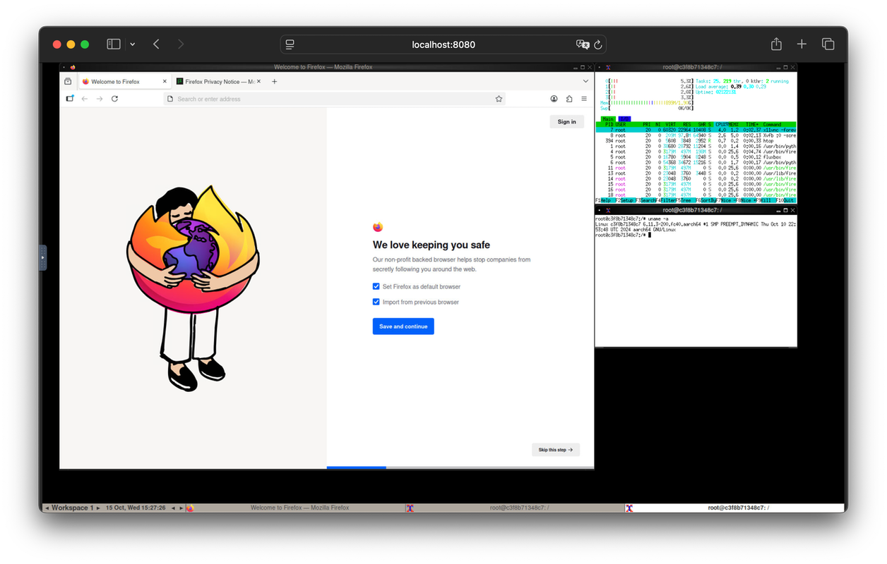

# noVNC Display Container

This container image is intended to be used for displaying X11 applications from containers in a browser.



## Container Contents

* [Xvfb](https://www.x.org/releases/X11R7.6/doc/man/man1/Xvfb.1.xhtml) - X11 in a virtual framebuffer
* [x11vnc](https://github.com/LibVNC/x11vnc) - A VNC server that scrapes the above X11 server
* [noNVC](https://novnc.com/info.html) - A HTML5 canvas VNC viewer
* [Fluxbox](https://www.fluxbox.org/) - A small window manager
* [Firefox](https://www.mozilla.org/en-US/firefox/new/) - A web browser
* [Chocolate Doom](https://www.chocolate-doom.org/wiki/index.php/Chocolate_Doom) - A :feelsgood: DOOM source port
* [xterm](https://invisible-island.net/xterm/) - A terminal
* [Mousepad](https://docs.xfce.org/apps/mousepad/start) - A text editor
* [supervisord](https://supervisord.org/) - To keep it all running

## Variables

You can specify the following variables (default):

* `DISPLAY_WIDTH=<width>` (1920)
* `DISPLAY_HEIGHT=<height>` (1080)
* `RUN_XTERM={True|False}` (False)
* `RUN_FLUXBOX={True|False}` (True)
* `RUN_FIREFOX={True|False}` (False)
* `RUN_DOOM={True|False}` (False)

## Build the Container

This command builds the Docker image from the `Dockerfile` in the current directory.
The `-t novnc` option tags the image with the name `novnc`.

```bash
docker build -t novnc .
```

## Run the Container

This command starts a container from the `novnc` image.

```bash
docker run -p 8080:8080 novnc
```

### Autostart Firefox Example

This command starts a container from the `novnc` image and automatically starts Firefox.

```bash
docker run -p 8080:8080 -e RUN_FIREFOX=True novnc
```

Open a browser and see the desktop at [`http://localhost:8080/`](http://localhost:8080/).


## Thanks

This container is based on the container by [@theasp](https://github.com/theasp): <https://github.com/theasp/docker-novnc>
